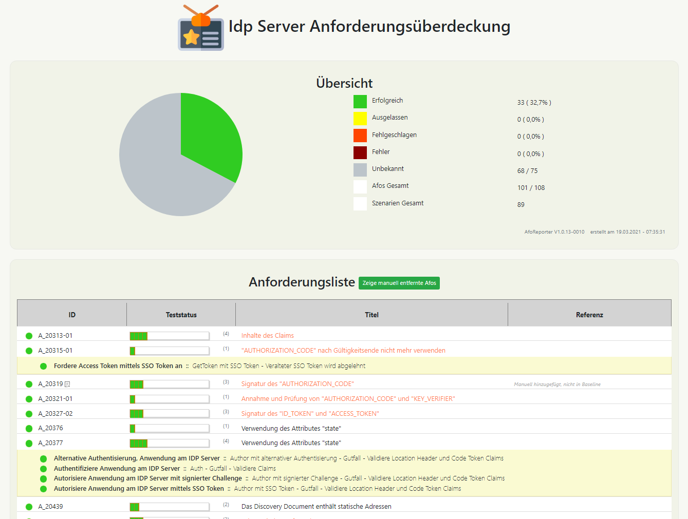
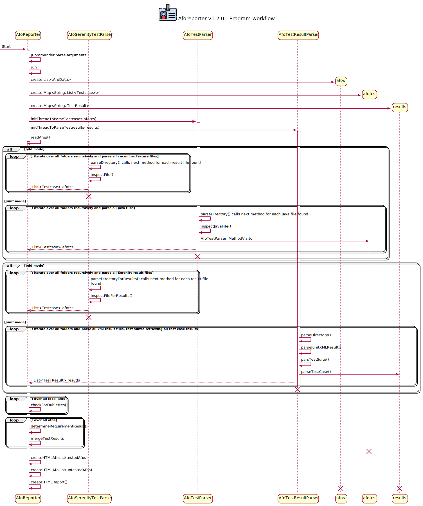

## AFO Reporter v1.0.15

Der AfoReporter ermöglicht es die Überdeckung von Testergebnissen mit Anforderungen zu erstellen.



## Kommandozeilenparameter

* -bdd (-b) definiert ein Basisverzeichnis, unterhalb welchem alle Serenity Testergebnis JSON Dateien geparsed werden.
  **(default: LEER!)**
* -testroot (-tr) definiert ein Basisverzeichnis, unterhalb welchem alle Test Methoden und Cucumber feature Dateien
  geparsed werden.
  **(default: "../idp-global/idp-server/src/test")**
* -resultroot (-tr) definiert ein Basisverzeichnis, unterhalb welchem alle JUNIT Testergebnis XML Dateien geparsed
  werden.
  **(default: "../idp-global/idp-server/target/surefire-reports")**
* -file (-f) Dateinamen (JSON Datei) aus der die Anforderungen gelesen werden sollen.
  **(default: requirements.json)**
* -template (-tpl): Verzeichnis in welchem HTML Vorlagen liegen die zur Erstellung des Berichts verwendet werden.
  **(default: es werden die im Jar Archive mitgelieferten Templates verwendet)**
* -dump (-d): whether to dump debug log messages to console or not. **(default false)**
* -out (-o): file to write the HTML report to **(default: target/site/serenity/aforeport.html)**

Zur Angabe mehrere Basisverzeichnisse einfach den Parameter wiederholt angeben. Unter Linux Beispielsweise:

```
java -jar target/aforeporter*.jar -tr ../idp-server/src/test/ -tr ../idp-testsuite/src/test/ -rr ../idp-client/target/surefire-reports -rr ../idp-testsuite/target/failsafe-reports -rr ../idp-server/target/surefire-reports
```

## Testcodeanpassungen für JUnit basierte Tests

Um einen Test mit einer Anforderung zu verlinken muss die Testmethode mit
der [@Afo Annotation](src/main/java/de/gematik/idp/tests/Afo.java) versehen werden. Als Wert der Annotation ist in der
Klammer in Anführungsstrichen die ID der Anforderung (NICHT des WorkItems), also das Polarion CustomField cfAfoId
einzutragen. Sollte eine Testmethode mehrere Anforderungen überdecken, so kann die Afo Annotation auch mehrfach
verwendet werden.

```
@Afo("A_17792")
@Afo("A_17758")
@Test
public void testValidTokenIsReturned() { ...
```

### Testergebnisse

Der AfoReporter erwartet die Testergebnisse als JUnit XML Dateien. Die Dateinamen müssen mit "TEST" beginnen und mit "
xml" enden. Bei Betriebssystemen, die Groß-/Kleinschreibung beachten bitte sicherstellen, dass die Dateien entsprechend
benannt erstellt werden.

## Testcodeanpassungen für Cucumber/BDD basierte Tests

Um einen Test mit einer Anforderung zu verlinken muss das Szenario mit einer (oder mehreren) @Afo Annotation(en)
versehen werden. Als Wert der Annotation ist getrennt durch einen Doppelpunkt ":" die ID der Anforderung einzutragen.
Sollte eine Testmethode mehrere Anforderungen überdecken, so kann die Afo Annotation auch mehrfach verwendet werden.

Gematik intern wird für die Afo ID das Polarion CustomField cfAfoId (NICHT die ID des WorkItems) verwendet.

```
@Afo:A_17792 @Afo:A_17758
Scenario: Authentication via signed challenge
  ...
```

### Testergebnisse

Der AfoReporter erwartet die Testergebnisse als Serenity Testergebnis Dateien. Die Dateinamen müssen mit "
json" enden. Bei Betriebssystemen, die Groß-/Kleinschreibung beachten bitte sicherstellen, dass die Dateien entsprechend
benannt erstellt werden.

[JUnit Testergebnis XML Deklaration](https://llg.cubic.org/docs/junit/)

## Zusätzliche Informationen zu den Afos

In der lokalen Cache Datei gibt es drei Attribute für jede Afo die in der Datei geändert werden können. Um eine Referenz
auf Spezifikationsdokumente zu einer Afo hinzuzufügen können folgende Attribute genutzt werden:

* ```refName``` Name der Referenz der Afo
* ```refURL``` (Optional) wenn nicht null, dann wird der Referenzname im Report mit einem Link auf diese URL versehen.

Um zusätzliche Afos, welche nicht definiert wurden, hinzuzufügen, muss ein AfoData Block eingefügt und mit dem "added "
AfoStatus versehen werden.

* ```AfoStatus``` kann zwei Werte enthalten. "added" für manuell hinzugefügte Afos. "deleted" um Afos im Report zu
  verstecken.

## Entwicklerdokumentation

Durch ```mvn site``` wird im target/site/apidocs/index.html eine Javadoc Dokumentation erstellt, welche die Paket- und
Klassenstruktur graphisch in den Javadoc Seiten eingebettet darstellt.

Nach Aufruf erstellt das livingdoc plugin ein aforeport.plantuml, welches dann gemeinsam mit dem workflow.plantuml (
welches manuell gepflegt wird) in SVG Graphiken umgewandelt wird.

Anbei das Sequenzdiagramm



## TODO

* How to deal with data provided test cases